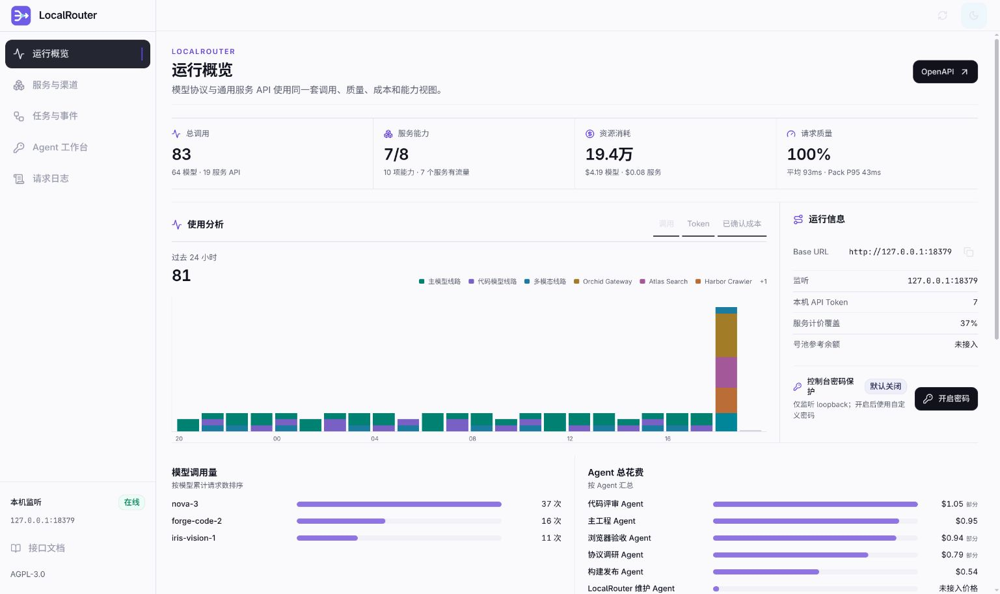
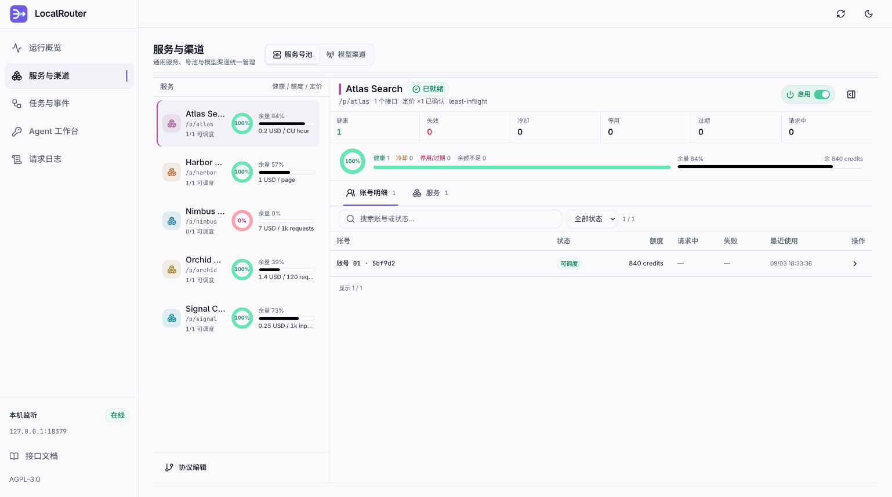
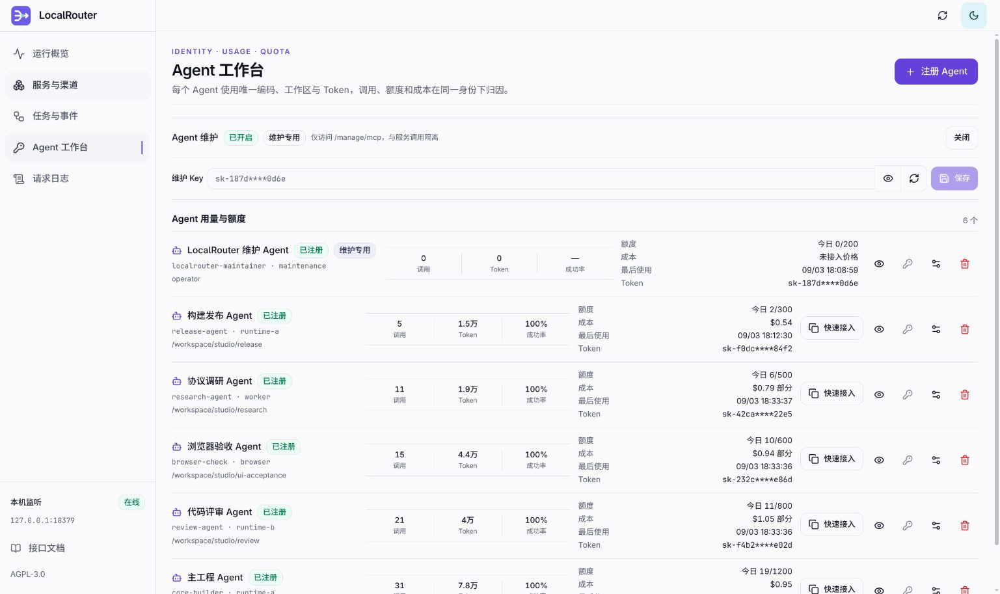

<div align="center">


# LocalRouter

**轻量、好看的本机优先 AI / API 网关**

把模型 API、普通 REST、SSE、文件、WebSocket、gRPC、异步任务和账号池，收进一个可发现、可配置、可回滚的本机入口，并可显式向可信局域网开放仅限调用的服务面。


[快速开始](#一分钟启动) · [界面预览](#界面预览) · [能力一览](#能做什么) · [Agent 接入](#agent-如何使用和维护) · [开发文档](#开发与验证)

[源码](https://github.com/vimalinx/LocalRouter) · [LINUX DO 社区推广](https://linux.do/) · [安全政策](SECURITY.md) · [贡献指南](CONTRIBUTING.md) · [发布记录](CHANGELOG.md)

</div>

---

<a href="docs/images/localrouter-overview.jpg">
  
</a>

<p align="center"><sub>运行概览使用本机合成数据，点击图片可查看原尺寸。</sub></p>

## 一个运行时，接住本机和可信局域网 API

LocalRouter 用自己的 Go 运行时管理本地 SQLite 渠道与 Token、同模型多渠道选路、流式透传、请求日志、声明式 Protocol Pack、账号池、异步工作流、Agent 文档和哈希绑定发布。编译与运行不依赖外部网关源码。

对应用来说，它提供稳定的本机 Base URL。对 Agent 来说，每项能力都有可以机器发现的契约、价格、可用状态和调用地址。对维护者来说，渠道、号池、协议、额度与成本都能在同一套控制台里看清。

<table>
  <tr>
    <td width="33%" valign="top"><strong>统一调用</strong><br><br>模型协议、普通 API、流式响应、文件、WebSocket、gRPC 与异步任务共用一个本机入口。</td>
    <td width="33%" valign="top"><strong>统一管理</strong><br><br>服务、模型渠道、账号池、价格和健康状态放在同一个工作区，支持即时启用与停用。</td>
    <td width="33%" valign="top"><strong>统一归因</strong><br><br>每个 Agent 绑定独立编码、工作区和 Token，调用量、资源消耗、成本与额度逐 Agent 统计。</td>
  </tr>
</table>

它不是账号注册平台，也不接管人工 OAuth、CAPTCHA、支付或订阅。公开发行版不附带任何供应商 Pack、真实上游地址、账号池或供应商专用适配器；安装完成后，只有本机操作者明确发布的私有配置才会产生可调用能力。

## 一分钟启动

源码安装需要 Go 1.25.13+、Bun 和 Git；Release 压缩包只包含通用主网关和管理工具。

```bash
git clone https://github.com/vimalinx/LocalRouter.git
cd LocalRouter
./tools/install-localrouter.sh install
```

然后打开

- 控制台　<http://127.0.0.1:8317/>
- Agent 文档　<http://127.0.0.1:8317/docs>

需要 Docker 或让其他局域网设备调用时，使用 [Docker 与 LAN 部署指南](docs/DOCKER.md)。局域网监听器只提供要求 Service Token 的调用面，控制台和维护接口仍留在本机回环地址。

<details>
<summary><strong>安装器具体做了什么</strong></summary>

安装器把主程序和 `lr` 放入 `~/.local/bin`，创建并启动 `localrouter.service` 用户服务；同时将 `localrouter-protocol-pack` 安装到 `~/.agents/skills/` 和 `~/.omp/agent/skills/`，并以可识别、可原子替换的 managed block 更新 `~/.agents/AGENTS.md`、`~/.codex/AGENTS.md` 与 `~/.omp/agent/AGENTS.md`。

共享 Agent、Codex 与 OMP 从任意仓库都能先发现 `lr`。新增模型、Provider、Pack、认证、池、工作流、文档或发布任务时，Agent 会自动找到受控生命周期。若同名目录不属于此前由 LocalRouter 安装的 Skill，或 AGENTS 文件中的 managed block 已损坏，安装器会拒绝覆盖。

卸载会精确移除 LocalRouter 自己的全局 block 与带所有权标记的 Skill，并保留其他 Agent 指令以及用户配置、数据库、Key 和状态。

```bash
./tools/install-localrouter.sh uninstall
```

</details>

首次启动遵循 XDG Base Directory Specification。

| XDG 目录 | 默认位置 | 内容 |
|---|---|---|
| 配置 | `~/.config/localrouter` | `config.env`、模型渠道 Profile、可编辑 Protocol Packs |
| 数据 | `~/.local/share/localrouter` | SQLite、可选控制台密码、管理 Key、API Key、Provider 凭据与池定位器 |
| 状态 | `~/.local/state/localrouter` | 调用事件、工作流、调度状态、草稿和发布历史 |
| 缓存 | `~/.cache/localrouter` | 可删除的临时缓存 |

私有目录使用 `0700`，Key、数据库和状态文件使用 `0600`。运行
`localrouter paths` 可以查看当前机器解析后的路径，但不会显示任何 Key。

## 界面预览

### 服务、号池和价格放在一起

<a href="docs/images/localrouter-services.jpg">
  
</a>

服务列表会同时给出可调度数量、上游剩余额度与计价。选中服务后，可以继续查看账号明细、子服务和各自的价格规则。查不到可靠价格时显示“未接入价格”。

### 每个 Agent 都有自己的账

<a href="docs/images/localrouter-agent-workbench.jpg">
  
</a>

Agent 工作台把身份、工作区、调用 Token、请求额度和成本归因放在同一行。维护入口单独启用，维护 Key 支持隐藏、显示、随机生成与保存。服务调用 Token 与维护 Token 仍然彼此隔离。

> 三张截图均来自隔离的本机演示实例，使用虚构服务、模型和 Agent 名称。

## 可选的控制台密码保护

控制台默认只监听 loopback，并以免密模式直接进入，不需要查找或输入密钥。需要防止同一用户会话中的其他本机进程访问管理 API 时，可在“运行概览 → 控制台密码保护”中开启，并当场设置自己的密码。

- 长度为 16 到 512 个可打印 ASCII 字符；
- 允许中间空格，不允许首尾空白；
- 服务端原子写回 XDG 数据目录中的 `admin-token`，把开关写入 `admin-auth.json`，两者都保持 `0600`；
- 新密钥立即生效，不需要重启；
- 当前标签页自动切换到新密钥，其他旧标签页会失效；
- 密码不会出现在 API 响应、日志或 LocalStorage 中；
- 可随时关闭密码保护，恢复默认免密模式，无需重启。

控制台密码保护与人工维护 MCP 共用本机管理员凭据，但要求它的入口不同。`/local/api/*` 是否要求该凭据由控制台开关决定，`/manage/mcp` 的人工维护入口始终要求它，服务调用则始终使用另一套 API Token。更改控制台密码不会影响已经发给应用或 Agent 的 API Token。

## Agent 工作台与用量归因

“Agent 工作台”把调用身份、工作区、服务 Token 和额度策略绑定在一起。新增 Agent 时必须登记本机唯一的 `agent_code`、显示名称与工作区，可选记录 Codex、Claude、OMP 等运行时；随后由 LocalRouter 签发一枚只属于该 Agent 的 Token。除受保护的系统初始化 Token 外，未登记编码或工作区的历史 Token 会被服务入口拒绝，操作者可在工作台补齐资料后恢复使用。

工作台按 Token ID 合并兼容模型日志与 Protocol Pack 事件，展示每个 Agent 的调用量、输入/输出 Token、成功率、最后使用时间、已知成本和今日请求额度。成本缺少可靠价格时显示“未接入价格”或“部分”。每分钟请求、每日请求和最大并发复用 Token Policy，快速接入按钮只在操作者主动点击时临时读取 Token 并复制本机环境变量，不把密钥写入页面存储。

模型供应商 API Key 与 Protocol Pack 号池现在集中在“服务与渠道”工作区的两个一级标签中；号池仍遵守自身的 `local`、`external` 或 `external-readonly` 所有权。工作台只保留已注册 Agent 列表与维护入口，不会把外部维护者拥有的池或注册流程静默迁入 LocalRouter。开启 Agent 维护时，控制台会创建或复用独立的维护 Agent Token，并允许像密码一样显示、随机生成和轮换自定义 Key；这枚 Token 只能访问 `/manage/mcp`。

“服务与渠道”中的 Protocol Pack 和每个已发布 operation 都有即时启用/停用开关。该状态写入数据目录的私有 `service-controls.json`，只作为运行态调度覆盖，不修改 Pack 文件、发布 digest 或草稿；Pack 定义本身停用时不能由运行态开关强制启用。人工协议发布入口不再占据主导航，而是收进同一工作区的 AI 优先大编辑面板。

## 能做什么

| 能力 | LocalRouter 的处理方式 |
|---|---|
| 模型协议 | OpenAI-compatible（含 Responses 等同协议入口）、Anthropic Messages 与 Gemini 原生透传 |
| 普通服务 API | 通过 Protocol Pack 声明路径、查询、请求头、请求体、响应与错误转换 |
| 流和二进制 | SSE、multipart、文件与未知内容优先采用字节透传 |
| 双向/高性能协议 | WebSocket、原始 gRPC、loopback adapter 和受限 WASM adapter |
| 异步任务 | 创建、轮询、继续、取消、结果提取和重启恢复 |
| 账号池 | 本地轮换、冷却、并发租约、资源粘性、健康状态与额度遥测 |
| 同服务多供应商 | `/v1` 按同模型渠道的优先级/权重路由；每条模型渠道和每个 Protocol Pack target 都可使用同一套供应商请求 Profile，固定、移除或补充转发安全请求头并控制 User-Agent 与查询串；Pack 另可用 `target_selector` 把多组 key 安全映射到固定兼容后端 |
| 模型协议 Profile | `$XDG_CONFIG_HOME/localrouter/channel-profiles.json` 声明请求路径归属、默认地址、鉴权位置和模型目录解析；增加 header/query/no-auth 供应商不改 Go 源码 |
| 外部号池 | 支持 `external` 与 `external-readonly`，不强行迁移外部网关的所有权 |
| Agent 维护 | 端口发现、草稿、影响审查、精确 digest 发布、历史与回滚 |
| Agent 身份与计量 | 唯一编码、工作区、绑定 Token、逐 Agent 调用/Token/成本归因与请求额度 |

Protocol Pack 不限定 LLM，也不假设请求或响应一定是 JSON。仓库只发布 Schema、生命周期工具和虚构测试夹具，不发布可连接真实服务的 Pack。测试夹具只在隔离测试目录运行，不会被安装、嵌入或出现在运行时发现结果中。

## 运行结构

```text
本机 App / Agent
        │  API Token
        ▼
  127.0.0.1:8317
        │
        ├── /v1   模型兼容入口
        ├── /p    自定义 Protocol Pack
        ├── /w    持久化异步工作流
        ├── /mcp  Agent 工具发现与调用（服务 Token）
        ├── /manage/mcp  语义化维护（管理密钥；可选维护 Token）
        └── /docs 运行契约、OpenAPI 与用法指南
                 │
                 ▼
       渠道 / 本地号池 / 外部网关
```

LocalRouter 的完整操作者入口强制监听回环 IP。可选 LAN 服务监听器只注册经过 Service Token 保护的消费路由，不注册控制台、`/local/api` 或 `/manage/mcp`。请求参数不能选择任意上游地址、认证端点、adapter 路径或 WASM 模块。

同一个模型仍可配置多条 `/v1` 兼容渠道，但 Agent 能力面不会把这些供应商折叠成一个条目。每个 Pack 和 operation 都保留独立 `operation_key`、地址契约、模型映射、价格、readiness 与号池状态。只有同一供应商、同一调用契约下的多枚凭据才进入该 Pack 自己的号池做轮换；跨供应商能力只以共享语义标签并列发现，由 Agent 明确选择。

## 本机入口

| 入口 | 地址 |
|---|---|
| 控制台 | `http://127.0.0.1:8317/` |
| 健康状态 | `http://127.0.0.1:8317/healthz` |
| Agent 发现 | `http://127.0.0.1:8317/.well-known/localrouter.json` |
| 文档首页 | `http://127.0.0.1:8317/docs` |
| 机器索引 | `http://127.0.0.1:8317/docs/index.json` |
| 汇总 OpenAPI | `http://127.0.0.1:8317/docs/openapi.json` |
| MCP | `POST http://127.0.0.1:8317/mcp` |
| 维护 MCP | `POST http://127.0.0.1:8317/manage/mcp` |
| 号池目录 | `http://127.0.0.1:8317/docs/pools/index.json` |

`/doc` 是 `/docs` 的永久重定向别名。

## 可选局域网服务入口

在 `config.env` 中显式配置私有地址即可让局域网设备使用消费 API：

```text
LOCAL_GATEWAY_LAN_ENABLED=true
LOCAL_GATEWAY_LAN_HOST=192.168.1.10
LOCAL_GATEWAY_LAN_PORT=8318
```

局域网入口提供 `/v1`、`/v1beta`、`/p`、`/w`、`/mcp`、`/agent`、发现和脱敏文档。它不提供控制台、`/local/status`、`/local/api` 或 `/manage/mcp`。应为每台设备或 Agent 签发独立 Service Token，并通过主机防火墙把端口限制在预期私有网段。浏览器客户端还需配置精确的 `LOCAL_GATEWAY_LAN_ALLOWED_ORIGINS`；命令行与 Agent 客户端不需要该设置。

## 接入已有的本机上游

1. 在外部服务中完成它自己的登录、账号池和刷新配置。
2. 确认它的固定回环端点已经可用。
3. 在 LocalRouter 中创建私有渠道或 Protocol Pack。
4. 填写固定的本机 Base URL、协议和所需凭据定位。
5. 测试渠道，再把客户端 Base URL 改为 LocalRouter。

外部服务继续拥有登录状态和账号生命周期。LocalRouter 不复制这些状态，也不会在请求路径里执行人工授权。该配置只存在于本机 XDG 目录，不属于公开发行版的支持清单。

## Agent 如何使用和维护

普通消费者不需要文件系统权限。

1. 请求 `/.well-known/localrouter.json`；
2. 沿返回链接读取 Manifest、OpenAPI、示例和 Markdown 指南；
3. 通过 `/mcp` 的 `tools/list` 发现所有已发布且就绪的操作；
4. 使用 API Token 调用 `/v1`、`/p`、`/w` 或 `/mcp`。

发现结果是可执行契约，不需要 Agent 拼路径。`operation_key`/`operation_id` 是供 catalog、describe、preflight、`lr` 和 MCP 使用的语义选择标识；它们不是 URL。凡是已经单独传入 Pack 的 `lr` 命令，operation 参数同时接受裸 `operation_id` 和可直接从目录粘贴的 Pack-qualified `operation_key`。直接发 HTTP 时必须使用每个 operation 已解析好的 `call_url` 和 `call.methods`。例如 `operation_id=chat.completions` 可以对应 `call_url=/p/provider/chat/completions`，不能把点号直接当路径分隔符写成 `/p/provider/chat.completions`。Manifest、示例、Agent descriptor 与 OpenAPI 都发布同一个 `call_url`，doctor 会把不一致判为失败。`request_example` 只表示请求形状；当 operation 发布 `dynamic_inputs` 时，先调用其中指向的模型/资源目录并使用当前返回值，不能把示例模型当成可用性证明。

### `lr` 给本机 Agent 的快速入口

仓库提供 [`tools/lr`](tools/lr)，把 discovery、文档定位、operation 搜索、鉴权和 MCP 调用收敛成一个轻量 CLI。服务命令只从 `0600` 文件读取 API Token；维护命令默认读取独立的管理密钥。任何凭据都不会被导出或打印。

```bash
lr status
lr tree
lr tree codebuddy
lr find '适合长任务的文本模型'
lr find operation '聊天补全'
lr find model --exact 'provider:operator-model'
lr find pool media-worker
lr catalog                       # 默认只返回前 20 条及 total/returned/truncated
lr catalog --all                 # 明确需要完整机器目录时再展开
lr catalog search-primary
lr resolve web.search
lr compare search-primary.query search-backup.query
lr describe search-primary query
lr call <pack> chat.completions '{"model":"example","messages":[]}'
lr preflight search-primary query '{"query":"LocalRouter","count":5}'
lr preflight media-worker asset.download '{}' '{"task_id":"task-example"}' '{"project_id":"project-example"}'
lr run search-primary query '{"query":"LocalRouter","count":5}'
lr watch <pack> <workflow> <job-id>
lr whoami
lr mcp-list responses
lr request GET /v1/models
```

`lr tree` 只读取一次 live discovery，把 `/v1`、`/v1beta`、`/p`、`/w`、`/mcp` 表面，以及全部 Pack、readiness、挂载点、池摘要、operation、workflow、adapter transport 和已发布的 OpenAI v1 Base URL 展成一棵树；它不逐个调用上游。看到目标后用 `lr show <pack>` 进入单个 Pack。完整 Protocol Pack 再走 `lr describe`、`lr preflight`、`lr call/run`，轻量兼容 Pack 使用它发布的标准路径和 `lr request`。

服务统一采用 Pack 视图，配置保持分级。只需要标准 OpenAI、Anthropic 或 Gemini 请求面、上游地址、Key、模型和同模型渠道轮换时，使用 Channel Profile + Channels 形成轻量兼容 Pack并直出 `/v1` 或 `/v1beta`；需要独立命名空间、自定义路由或转换、特殊认证、专属号池、adapter、异步 workflow 时，使用完整 Protocol Pack并挂载到 `/p/<pack>`。workflow 和 MCP 是 Pack 的执行视图，不需要再维护一份服务定义。

`lr describe` 直接返回所选 operation 的顶层合同（不是 HTTP API 的 `.data` 包装），因此 Agent 可以直接读取 `operation_key`、`call_url`、`request_schema`、`dynamic_inputs`、`pricing`、`pool` 与 `verification`。`request_schema` 的必填项是调用约束，不因供应商免 Key 或免费而放宽；免 Key 只影响上游鉴权。

先分清搜索对象。operation 是可调用契约，model 是就绪 Pack 从上游实时列出的模型 ID，pool 是号池 readiness、额度与价格，OMP/其他 Agent runtime 的模型分配则属于外部运行时。`lr find <混合意图>` 会把前三类分栏返回；已知类别时直接使用 `lr find operation|model|pool`，避免把模型名或运行时配置误当 operation。模型结果使用 `<pack>:<model-id>` 保留供应商身份，不跨供应商合并，并通过 `compatible_operations` 列出确实声明会消费该模型目录的操作；这条关系来自 Pack 的 `dynamic_inputs`，不靠 LocalRouter 猜它是不是聊天、图片、视频或其他 API。模型和 catalog 默认最多返回 20 条并给出 `count/returned/truncated`；先缩小查询，只有确需全量时才用 `--all`。最终选择模型时使用 `lr find model --exact <pack>:<model-id>`，零结果就是不可调用，不能把 fuzzy 建议当精确命中。

推荐调用顺序是 `find/catalog/resolve → compare（有多个候选时）→ Agent 明确选择 operation_key 与 model_key → describe → preflight → run`。`catalog` 返回 Token 允许访问的独立 operation 分页视图；`--all` 才展开完整目录。`resolve` 只解析 operation，并返回所有精确匹配（没有精确匹配时才做宽松文本匹配），默认同时保留 ready 与 unavailable 项；`compare` 按调用者给定顺序返回完整独立合同与 verification 层级，永远不输出推荐项。LocalRouter 不合并供应商、不隐藏差异，也不替 Agent 选择某一家。每项分别公开 Pack、号池、readiness、capabilities、aliases、请求/响应 schema、价格、重试、指南、工作流和调用路径。`preflight` 检查鉴权、模型策略、Pack/号池、operation、必需 path/query parameters、输入 schema、价格状态和副作用，但不会访问上游或消费额度；因此动态模型存在性必须由前一步的 `find model --exact` 证明。`preflight` 的 `ok=false` 会让 CLI 非零退出并返回具体 alternatives。第五个参数是 Query JSON；MCP 和 OpenAPI 也会把必需 Query 公开为机器约束。已知固定接口时可直接 `call` 或 `request`。异步任务使用 `run → watch`，`watch` 默认不设超时，Agent 中断后可凭同一个 Job ID 恢复；只有明确需要时才传超时秒数或调用 `cancel`。

发现文档顶层的 `contract.digest` 与 `/docs/index.json` 的 `contract_digest` 是同一份 Protocol Pack 契约摘要；`topology.digest` 覆盖 compatibility + Protocol Pack 服务树。Agent 可以缓存 operation 描述和服务树，但各自 digest 或 `schema_version` 变化时必须重新读取。调用失败时优先消费统一的 `code`、`reason`、`retryable`、`retry_after`、`next_action` 和 `alternatives`，不要从自然语言猜测是否重试。

普通 Token 默认长期有效、无分钟/每日/并发调用上限；实际资源安全由每个 Pack 的账号池并发、租约、冷却、健康和额度资格控制。它始终只用于调用，不能修改 LocalRouter。

维护默认走管理密钥，可由控制台或人工 `lr manage-*` 使用。控制台中的“Agent 维护令牌”开关默认关闭。只有人工打开它并把一枚独立 Token 标记为“维护专用”后，该 Token 才能访问 `/manage/mcp`；维护 Token 不能调用模型、Protocol Pack 或工作流，也不会得到控制台 Token 管理权或池 Secret。关闭开关会立即停用全部 Agent 维护 Token。

维护 Agent 应先加载 [LocalRouter Protocol Pack Skill](.agents/skills/localrouter-protocol-pack/SKILL.md)，再使用语义化工具。

```text
discover → open draft → put Pack / operation / supplier profile → lint
         → write guide / advanced patch → review impact
         → plan reviewed digest → apply exact digest → verify / rollback
```

Agent 通过语义工具建立并发布草稿。Pack core、单个 operation、单个供应商请求 profile 和 guide 都有各自的强类型入口；无 Key 服务省略 `auth` 时会生成 `auth.type=none`，operation 会生成 transport/retry/draft-availability 缺省值。`lint` 与 review 返回 `issues[].path`、允许值和修复动作。LocalRouter 负责格式、原子写入、严格校验和 digest；发布后会重新读取线上 Pack 树，本地验证失败时默认恢复上一修订并保留草稿。

Pack 交给 OpenAI 兼容运行时时，发布后的下一步固定为 `lr runtime-openai <pack> <exact-model>`。它核验 `GET /models` 和 `POST /chat/completions`，并输出 `/p/<pack>/v1` Base URL。上游 `/v1` 前缀仍留在 Pack target；随后以运行时真实一次请求验收。

任何 Agent 收到“把模型/Provider/本机服务接入 LR”“新增或修改 Pack”等请求，都按同一条维护跑道行动。加载 Skill → `lr manage-status` 选择已启用的维护 Token 入口或用户明确委托的本机维护入口 → 语义 MCP draft → 审阅 impact → plan/exact-digest apply → discovery 与 `lr find model --exact <pack>:<model-id>` 选择精确模型 → 运行时真实调用验收。没有发布入口时，Agent 仍可完成 discovery、上游探测和 draft 设计，并把所需授权说清楚。这个流程适用于 OMP、Codex、Claude 及其他 Agent；运行时只在 Pack 已发布和模型已实时发现之后接入。

人工维护终端可以直接使用；授权给 Agent 时还必须显式设置其 `LOCALROUTER_MAINTAINER_TOKEN_FILE`。

```bash
lr manage-list
lr manage-call localrouter_draft_open '{"draft_id":"agent-change"}'
lr manage-call localrouter_draft_put_pack '{"draft_id":"agent-change","pack_id":"publicapi","name":"Public API","description":"No-key API","base_url":"https://provider.example/v1"}'
lr manage-call localrouter_draft_put_operation '{"draft_id":"agent-change","pack_id":"publicapi","operation":{"operation_id":"models","methods":["GET"],"path":"/models","summary":"List models"}}'
lr manage-call localrouter_draft_lint_pack '{"draft_id":"agent-change","pack_id":"publicapi"}'
lr manage-call localrouter_draft_review '{"draft_id":"agent-change"}'
```

人工控制台 `/#control` 与维护工具读取同一份草稿、影响范围和 digest。Provider 凭据、账号内容、私有上游和 locator 不会通过维护工具返回。

仓库侧辅助命令如下。

```bash
./tools/protocol-pack-lifecycle.sh validate
./tools/protocol-pack-lifecycle.sh plan
./tools/protocol-pack-lifecycle.sh apply <reviewed-digest>
./tools/protocol-pack-lifecycle.sh history
./tools/protocol-pack-lifecycle.sh rollback <known-digest>
```

## 配置

安装器在 `$XDG_CONFIG_HOME/localrouter/config.env` 创建配置。可参考
[`packaging/localrouter.env.example`](packaging/localrouter.env.example) 调整端口或目录；
`LOCAL_GATEWAY_HOST` 只接受回环地址。源码目录中的 `gateway/.env` 仅作为开发运行入口。

| 服务端变量 | 默认值 |
|---|---|
| `LOCAL_GATEWAY_HOST` | `127.0.0.1`，只接受回环地址 |
| `LOCAL_GATEWAY_PORT` | `8317` |
| `LOCAL_GATEWAY_CONFIG_DIR` | `$XDG_CONFIG_HOME/localrouter` |
| `LOCAL_GATEWAY_DATA_DIR` | `$XDG_DATA_HOME/localrouter` |
| `LOCAL_GATEWAY_STATE_DIR` | `$XDG_STATE_HOME/localrouter` |
| `LOCAL_GATEWAY_CACHE_DIR` | `$XDG_CACHE_HOME/localrouter` |
| `LOCAL_GATEWAY_PROTOCOL_DIR` | `$XDG_CONFIG_HOME/localrouter/protocols` |
| `LOCAL_GATEWAY_CHANNEL_PROFILES_FILE` | `$XDG_CONFIG_HOME/localrouter/channel-profiles.json`；模型兼容入口的协议、鉴权和模型目录配置 |

模型渠道不在核心中判断供应商名称。`channel-profiles.json` 的每个 Profile 独立声明本机兼容请求路径如何归类、默认 `base_url`、密钥放入哪个 header 或 query parameter、固定协议头，以及如何从上游模型目录提取 ID。安装时只在文件不存在时写入通用协议族 Profile；之后人工或 Agent 修改配置不会被升级覆盖。非标准登录、浏览器会话或多阶段签名可由操作者自行部署固定 loopback `http-envelope` sidecar，核心只看到统一 envelope；公开发行版不附带任何供应商 sidecar。

登录密钥不放在环境文件中；请通过控制台安全轮换。Provider 凭据、Cookie
和池内容必须留在 `$XDG_DATA_HOME/localrouter` 或外部权威池中。

本机 Agent 可使用下列客户端环境变量；只配置 URL 和文件定位，不配置 Token 值。

| 变量 | 默认值/用途 |
|---|---|
| `LOCALROUTER_BASE_URL` | `http://127.0.0.1:8317` |
| `LOCALROUTER_ALLOW_LAN` | 默认 `false`；远端客户端显式接受经过发现验证的 LAN service-only 地址 |
| `LOCALROUTER_DISCOVERY_URL` | `/.well-known/localrouter.json` 的完整地址 |
| `LOCALROUTER_DOCS_URL` | 文档首页 |
| `LOCALROUTER_OPENAPI_URL` | 汇总 OpenAPI |
| `LOCALROUTER_MCP_URL` | MCP JSON-RPC 入口 |
| `LOCALROUTER_MAINTENANCE_MCP_URL` | 维护 MCP，默认 `http://127.0.0.1:8317/manage/mcp` |
| `LOCALROUTER_API_TOKEN_FILE` | 默认 `$XDG_DATA_HOME/localrouter/api-token` |
| `LOCALROUTER_MAINTAINER_TOKEN_FILE` | 可选；显式指定已授权 Agent 的维护专用 Token locator；无默认值 |
| `LOCALROUTER_ADMIN_TOKEN_FILE` | 默认 `$XDG_DATA_HOME/localrouter/admin-token`；控制台密码保护开启时用于 `/local/api/*`，并始终供人工 `lr manage-*` 使用；不交给消费型 Agent |

`lr` 默认拒绝非回环 Base URL。使用操作者批准的 LAN 地址时，客户端还必须设置 `LOCALROUTER_ALLOW_LAN=true`；`lr` 会先无密钥读取 discovery，确认 `scope=lan-service` 且维护面不可用，再读取并发送 Service Token。维护 URL始终只允许回环地址。符号链接 Token 文件、错误所有者以及非 `0600` 权限仍会被拒绝。

`/p/<pack>` 是 LocalRouter 给每个独立 Protocol Pack 保留的挂载命名空间，用来避免不同 Pack 的 `/models`、`/chat/completions` 等路由互相覆盖。满足 OpenAI 模型与聊天契约的 Pack 还会自动发布 `/p/<pack>/v1` 兼容 Base URL。

```bash
lr runtime-openai codebuddy hy4-preview
```

输出的 `base_url` 已包含 Pack 命名空间与 `/v1`。把它和精确 `model` 填入运行时；适配器会补 `/models` 或 `/chat/completions`。原生 `/p/<pack>/...` 路径继续保留兼容已有调用。

已有仓库内运行数据可在安装时非破坏性复制并拆分到 XDG 目录；原目录不会删除。

```bash
./tools/install-localrouter.sh install --migrate-from ./gateway/data
```

## 开发与验证

```bash
make -C gateway web-test
go -C gateway test ./...
go -C gateway vet ./...
./tests/verify.sh
make docker-test
```

发布前运行完全隔离的洁净发行门禁。

```bash
./tests/clean_release_acceptance.sh
```

它会从当前 Git 索引重建无本机状态的副本，执行前端构建、Go 验证、协议验收、Skill 测试、Gitleaks、govulncheck 和 OSV。真实 Provider、真实号池和付费调用只在显式配置并取得授权后运行。

更深入的资料如下。

- [网关运行与接口](gateway/README.md)
- [Protocol Pack v3](docs/PROTOCOL-PACK-V3.md)
- [协议与号池架构](docs/PROTOCOL-ARCHITECTURE.md)
- [开源发行门禁](docs/OPEN_SOURCE_RELEASE.md)
- [Docker 与 LAN 部署](docs/DOCKER.md)
- [历史来源与独立边界](PROVENANCE.md)
- [贡献指南](CONTRIBUTING.md)
- [安全策略](SECURITY.md)

## 边界与许可证

LocalRouter 的早期实现参考并复用了 QuantumNous New API；当前运行时已无其源码或模块依赖，但这不是 clean-room 重写，历史归属见 [PROVENANCE.md](PROVENANCE.md)。本项目继续采用 [AGPL-3.0](LICENSE)，直接依赖许可证见 [THIRD-PARTY-LICENSES.md](THIRD-PARTY-LICENSES.md)。

注册、CAPTCHA、人工 OAuth 同意、支付、反机器人挑战和账号生产不属于 LocalRouter 的请求运行面。
